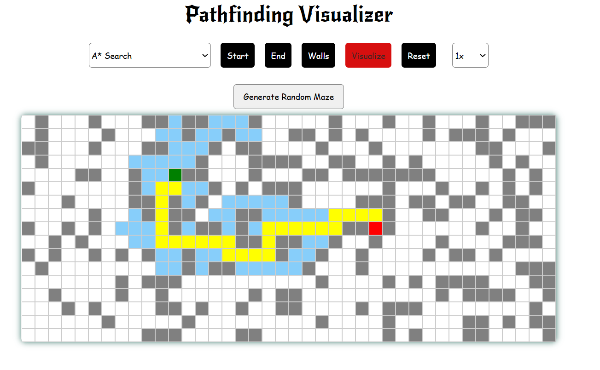

#  Pathfinding Algorithm Visualizer

This is a **React-based pathfinding algorithm visualizer** that demonstrates how various algorithms work in real-time. You can interactively place a **Start** node, **End** node, build **walls**, generate **random mazes**, and visualize paths using algorithms like **A\***, **Dijkstra's**, **BFS**, and **DFS**.

## ✨ Features

-  **Visualize Popular Algorithms**:
  - A* (A-Star)
  - Dijkstra’s Algorithm
  - Breadth-First Search (BFS)
  - Depth-First Search (DFS)
-  Drag & drop **Start** and **End** nodes
-  Click and drag to build **walls/obstacles**
-  **Random Maze Generator**
-  Real-time **Step-by-step visualization** 
-  Set the **speed** as per your preference. 
-  **Reset Board** button to clear everything
-  Toggle between algorithms without refreshing

## 📸 Screenshots

> 

## 🚀 Getting Started

### Prerequisites

- Node.js (v14+)
- npm 

### Installation

1. Clone the repository:
   ```bash
   git clone https://github.com/Darak123ras/pathfinding-visualizer.git

2. Navigate into the project directory:

    ```bash
    cd pathfinding-visualizer

3. Install dependencies:
   ```bash
    npm install
4. Start the development server:
   ```bash
    npm run dev
5. Open http://localhost:5173 to view it in your browser.

## 🎨 Tech Stack
- Frontend: React (with Vite)
- Language: JavaScript
- Styling: CSS

 ## 🙌 Inspiration

This project was inspired by [Clement Mihailescu's Pathfinding Visualizer](https://github.com/clementmihailescu/Pathfinding-Visualizer).  
Special thanks for the idea and inspiration!

 
